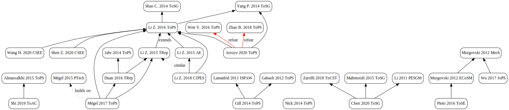

# Literature review on convex storage loss modeling and relaxation

These _draft_ notes are a review of existing articles on convex storage loss modeling:
- Which kind of model: lossless, PWL-in-P, Quadratic-in-P?
- How is the loss relaxation (if used) introduced and justified?

PH, Nov 2020

Citation graph (partial):

## List of articles

(more or less in reading order)

### Shi 2019 ToAC

"Optimal Battery Control Under Cycle Aging Mechanisms in Pay for Performance Settings"

Content:

- _PWL storage model_ with $η_c, η_d$
  - losses relaxation, with little discussion
- Rainflow aging model, and prove its convexity
- subgradient algorithm

> Note here we may include a constraint that storage cannot charge and
> discharge at the same time [40: Almassalkhi 2015 ToPS],
> but it turns out that this condition will always be satisfied in our setting.

### Almassalkhi 2015 ToPS [HIGHLY RELEVANT]

"Model-Predictive Cascade Mitigation in Electric Power Systems With Storage and Renewables
— Part I: Theory and Implementation"

Cited by Shi 2019 ToAC as the reference on charge/discharge complementarity condition.

Content:
- MPC mitigating line-overload (exploits the thermal inertia of conductors)
- bilevel control (Level 1: Optimal Energy Schedule, Level 2: Corrective Control)
  - formulated as two QPs
- piece-wise linear _convex_ approximation of line losses
- _PWL storage model_ with $η_c, η_d$ (eq 21, p5)
  - losses relaxation, with extensive discussion
    (from _nonlinear complementarity_ constraint $P^+.P^- = 0$ )
  - mitigation of relaxation problem with heuristic added to MPC

> Remark III.5:
> This model permits simultaneous charging and discharging.
> While this is mathematically _feasible_, it is generally not _physically_ realizable
> (i.e., some hydro-storage can simultaneously charge/discharge,
> but most electrical storage devices cannot).
> A more accurate energy storage model would employ the complementarity condition
> $P^+.P^- = 0$, but that results in a difficult nonlinear model [27].
> Instead of applying an integer-based approach to model the complementarity condition
> (see Remark III.3 [where the Integrality contraint is presented, but then dropped]),
> the MPC model **relaxes complementarity**.
> This introduces modeling inaccuracy between plant and controller
> that is proportional to $1 - η_c.η_d$ [I don't understand this]
> However, as discussed in Appendix A, a _heuristic algorithm_ can be employed
> to reduce the occurrence and effects of simultaneous charge/discharge events.

And in the Appendix A ("Simultaneous charging and discharging"):

1. Theorem A.1 prooves that the absence of complementarity constraint
   allows a drop of SoE bounded by eq (34), which is 0 for 100% efficiency
2. Bound $P^+ + P^- \geq P_{rated}$ reduces this worst case
3. The "Fig. 4" heuritic algorithm is added to the MPC to fix
   the charge/discharge status in two passes.

References:
- [27] Bai _et al._, “On convex quadratic programs  with linear complementarity constraints,”
  Computat. Optimiz. Applicat., 2013.

### Chen 2020 ToSG

"Aggregate Power Flexibility in Unbalanced Distribution Systems"

Content:
- _linear-in-E_ storage loss model (eq 5c)
- _PWL-in-P_ loss model abandonned because of non convexity
- "Inner-box approximation for the aggregated power feasible region" (Fig. 3)
- two convex optimization models

> Remark 2:
> The DER models (4)-(7) are approximate for the trade-off
> between model precision and computational efficiency.
>
> Take the energy storage model (5) for example.
> A more realistic model than (5) would have distinct charging
> and discharging efficiencies, which would render the model
> **nonconvex** and therefore hard to analyze and compute, due to
> the complementarity constraint for charging and discharging power [23].
>
> For computational efficiency, the simplified energy
> storage model (5) is generally acceptable in practice [22]–[24].
> Furthermore, the proposed power aggregation method is a
> generic framework applicable to the cases with various DER
> models that can be more detailed and realistic.

References:

- [22] Mahmoodi _et al._ “Economic dispatch of a hybrid microgrid with distributed energy storage,” ToSG 2015
- [23] Zarrilli _et al._ “Energy storage operation for voltage control in distribution networks: A receding horizon approach,” ToCST 2018
- [24] Li  _et al._ “Optimal demand response based on utility maximization in power networks,” IEEE PES Gen. Meeting, 2011

### Mahmoodi 2015 ToSG

“Economic dispatch of a hybrid microgrid with distributed energy storage”

content:
- _distributed_ economic dispatch strategy for microgrids with multiple energy storages.
- _lossless_ storage model (eq 3)
  - no discussion on efficiency

### Zarrilli 2018 ToCST

“Energy storage operation for voltage control in distribution networks: A receding horizon approach”

Cited by (Chen 2020 ToSG) as the source explaining the nonconvexity
of the complementarity constraint.

- _lossless_ storage model (eq 4,6)
  - with a remark on how to use PWL model, with relaxation
  - penalty added for double charge/discharge (eq 19),
    but it's _mixed with the penalty for aging_
- storage aging counted with energy throughput (eq 16)
  - added to the main objective (line losses minimization)

> Remark 1: (page 4)
> If needed, a more realistic model of ESS dynamics,
> accounting for battery efficiency, can be adopted.
> Let $r_s^c(t − 1) ≥ 0$ and $r_s^d(t − 1) ≥ 0$ be the average active power
> pumped into and drawn from the storage between t − 1 and t, respectively.
> Moreover, let $η_s^c , η_s^d ∈ (0, 1]$ represent
> the charging and discharging efficiencies of the ESS at bus s.
> Then, problem (14) can be extended by defining
>  $r_s(t − 1) = r_s^c(t − 1) − r_s^d(t − 1)$ (16)
> replacing the ESS dynamics (4) with
>  $e_s (t) = e_s(t − 1) + η_s^c r_s^c(t − 1)ΔT − 1/η_s^d r_s^d(t − 1)ΔT$ (17)
> and adding the complementarity constraints
>  $r_s^c(t − 1) . r_s^d(t − 1) = 0$ (18)
>
> The latter constraints enforce that each ESS
> _cannot be charged and discharged_ at the same time.
> The resulting problem can
> be _relaxed_ by removing (18) and replacing $C_S(t)$ in (11) with
> [a penalty on Sum of $r_s^c(t − 1) . r_s^d(t − 1)$ ]
> so as to penalize simultaneous charging and discharging.
> In this way, the formulated optimization problem maintains
> the same structure as (14) and can be tackled via analogous
> SDP-based convex relaxation techniques.

### Li 2011 PESGM

“Optimal demand response based on utility maximization in power networks”

content:
- lossless storage model

### Cai 2019 AE

“Aging-aware predictive control of PV-battery assets in buildings”

Content:
- MPC for a PV-battery system
- a _convex_ battery capacity loss model, derived from a physically-based degradation mode
- **lossless** storage model (eq 3)
  - with storage power splitted between positive and negave parts
    - useful for of a PWL-in-P capacity loss model
  - starts with a current based model, then converted to power based model
    ("voltage variation is lower than 1% within the considered SOC range. *
     Thus, V is assumed to be constant.")
- then storage efficiency<1 is introduced
- The capacity loss model (12) which is minimal at Pb=0 ensures a penalty
  for simultaneous charging and discharging (Theorem 3.1)
- a _relaxation_ is used for PV production, to preserve convexity
  - ("heuristic that uses PV power as much as possible to meet the building load")
  - quite similar to our relaxation of storage losses??s

End of §3.4 "Battery SOC":
> It is assumed that the battery cannot be
> charged and discharged simultaneously.
> This can be guaranteed with appropriate model treatment
> as discussed in Section 3.5 (Battery life cycle degradation)

In §3.5, a PWL-in-P capacity loss model is introduced
> The model formulation given in (12) does not inherently prevent
> simultaneous charging and discharging.
> But this constraint can be enforced by incorporating the energy efficiency losses
> in the charging and discharging processes, as shown in (18).

Comment: I feel like this is more a _penalty_ rather than the _garantee_.

### Chis 2016 EUSIP

“Demand response for renewable energy integration and load balancing in smart grid communities”

Content:
- Topic: Demand response energy management
- "Cobb-Douglas production function" -> geometric programming
- **lossless** storage model (§II)
  - reformulation as posynomial or monomial inequations to fit the GP framework
    (eq 12--17), which I didn't fully understand.
  - CVX for solving the load balancing optimization problem

### Rajasekharan 2014 JoSTSP (TO BE READ in more details)

"Optimal Energy Consumption Model for Smart Grid Households With Energy Storage"

> optimization problem of a household with energy storage is formulated
> as a geometric program for consumption balancing/leveling,
> while cost minimization is formulated as a linear programming problem

Content:
- _linear-in-E_ storage loss model (§II. SYSTEM MODEL, loss rate named $r$)
- Cobb-Douglas and other utily functions

There is a subsection "B. Effect of Battery Loss Rate" within "VI. SIMULATION RESULTS"

### Gemine 2017 OaE

“Active network management for electrical distribution systems: problem formulation, benchmark, and approximate solution”

(coauthor: Bertand Cornélusse)

content:
- solve large-scale optimal sequential decision-making problems under uncertainty
- problem cast stochastic MINLP, as well as SOCP and LP counterparts
- SOCP relaxation of the AC power flow equation (eq 86->87),
  with an issue of non tight inequality, which requires penalization ("the scaling factor of the losses discussed in Sect. 4.5.3 was fixed empirically to 3.", p35)
- **not about storage**, but gives references with storage

TODO: read email with Cornélusse

References using storage:

- Gayme D, Topcu U (2011) "Optimal power flow with distributed energy storage dynamics".
  In: _Proceedings of the 2011 American control conference (ACC)_
- Gill S, Kockar I, Ault G (2014) "Dynamic optimal power flow for active distribution networks."
  _IEEE Trans Power Syst_
- Macedo LH, Franco JF, Rider MJ, Romero R (2015)
  "Optimal operation of distribution networks considering energy storage devices".
  _IEEE Trans Smart Grid_

### Gill 2014 ToPS

“Dynamic optimal power flow for active distribution networks”

cited by Gemine 2017 OaE

Content:
- Active Network Management based on multi-temporal OPF (i.e. dynamic OPF), _with storage_
- _PWL storage model_, with no complementarity constraint (eq 10 + Fig. 1)
  - with a discussion on when the absence of complementarity is not a problem
    because simultaneous charge and discharge would be suboptimal
    > if: 1) the round-trip efficiency of the ESS is less than 1
    > and 2) the “cost” of all generation in the objective is positive.
- Apparent power contraint on power, i.e. quadratic P²+Q²<=S² (eq 18)
- Implemented with Matpower and its Interior Point Solver (MIPS)

About the storage model (p6):
> This formulation provides a significant improvement over existing techniques.
> For example, in [11], charging and discharging time-steps
> are _predefined_ as inputs to the formulations;
> in [12], the formulation does not predefine charging discharging time-steps
> but at the expense of a _full formation of efficiency_ [what does it means?]

References:

- [11] Gabash and Li, “Active-reactive optimal power flow in
  distribution networks with embedded generation and battery storage,”
  IEEE Trans. Power Syst, 2012.
- [12] Lamadrid _et al._, “Scheduling of energy storage systems
  with geographically distributed renewables,”
  in Proc. 9th Int. Symp. Parallel Distrib. Process. Applicat. Workshops, 2011,

### Gabash 2012 ToPS

“Active-reactive optimal power flow in distribution networks
with embedded generation and battery storage”

cited by (Gill 2014 ToPS) as an example where
"charging and discharging time-steps [of the storage] are _predefined_"

content:
- _PWL storage model_ (eq 10)
  - with charging and discharging phases _fixed_, based on price periods (eq 2)
- OPF formulated as large NLP

### Lamadrid 2011 ISPAW [TO BE READ]

“Scheduling of Energy Storage Systems with Geographically Distributed Renewables”

cited by (Gill 2014 ToPS), saying their storage model requires
a "_full formation of efficiency_ "

- storage  model?

### Murillo-Sanchez 2013 ToSG

“Secure Planning and Operations of Systems With Stochastic Sources, Energy Storage, and Active Demand ”

(MATPOWER Optimal Scheduling Tool (MOST) paper)

content:
- _PWL storage model_ (eq 22), but it's complicated to read since it's baked
  contigency reaction. There is also perhaps _linear-in-E_ loss.

### Zia 2019 ToIA

“Energy Management System for an Islanded Microgrid With Convex Relaxation”

> this paper aims at developing _integer-free_ second-order cone programming based EMS (SOCP-EMS)

- _PWL storage model_ (eq 20k), which is also used for a "Operation Cost" (eq 11)
  - First with NL complementarity constraint $P^+.P^- = 0$ (eq 20j)
   "Constraint (20j) prohibits battery’s concurrent charging and discharging operations"
  - then formulated as MILP (δ in {0,1}), and then relaxed as LP (δ in [0,1])
  - no discussion on the implication, except that in the end it works
    "The relaxed SOCP model solution is feasible and globally optimum,
    if it satisfies the original non-convex EMS problem constraints."
- Apparent power contraint on power, i.e. quadratic P²+Q²<=S² (eq 20p)

Convex formulation
> MG EMS problem (20a) is intrinsically a non-convex NLP model because of battery constraint (20j)
> [...] However, these constraints can be relaxed into convex ones [37: Boyd & Vandenberghe 2004 Book: too general to be useful].

-> it relaxed as the usual LP

### Nick 2014 ToPS [VERY RELEVANT]

“Optimal Allocation of Dispersed Energy Storage Systems in
Active Distribution Networks for Energy Balance and Grid Support”

Abstract:
> A convex formulation of ac optimal power flow problem is used to define a
> mixed integer second-order cone programming problem to optimally
> _site_ and _size_ the DSSs in the network

Intro:
> In this paper we adapted the second-order cone programming
> (SOCP) OPF approach of [25] to formulate the problem of the
> optimal allocation of DSSs in [Distribution Networks]

And very relevant is the modeling of storage in §II.C.2 "DSS Operation Constraints"
- _Quadratic-in-P_ storage loss (in fact proportional to P²+Q²: eq 13)
  - Perhaps it's more the losses of the inverter, since it's proportional to I²
    (hypothesis of constant node voltage explictly given)
  - Vocabulary: loss coefficient $r$ is called "loss factor (resistive)"
  - Nonconvex loss equality constraint is then relaxed to be >=
  - Explanation of the relaxation: "Since the losses of the DSSs are also
    minimized in the objective function, the relaxed inequality constraint
    is the same as the original equality constraint."
  - Quadratic constraint finally reformulated as Second Order Cone (eq 33)
- Apparent power contraint on power, i.e. quadratic P²+Q²<=S² (eq 12)
  - which is linearized by a set of lines (Fig. 1)

References:
- [25] Taylor and Hover, “Convex models of distribution system reconfiguration,”
  IEEE Trans. Power Syst., 2012.

### Pinto 2016 ToSE [VERY RELEVANT]

“Evaluation of Advanced Control for Li-ion Battery Balancing Systems Using Convex Optimization”

**P²/E loss** model

Relaxation:
> The right term is a convex function with respect to variables p and E
> [...] but equation (27) is not affine.
> However, relaxing (27) with inequality [27]–[29] and assuming that
> the cell’s power losses are lower bounded by (27) leads to: [the loss inequality]

Justification of relaxation:
> From a practical perspective this relaxation can be justified
> by the following: the cost function J(.) generally incorporates a
> term to penalize the power losses in the cells p l,j . Consequently,
> the numerical solver generally seeks to bring the power losses
> to the lower bound defined by (28).

References:
- [27] Murgovski  _et al._“Convex modeling of energy buffers in power control applications,”
  in Proc. 3rd IFAC Workshop Engine Powertrain Control Simul. Model., 2012.
- [28] Hu, Murgovski, _et al._ “Comparison of three electrochemical energy buffers
  applied to a hybrid bus powertrain  with simultaneous optimal sizing and energy management,”
  IEEE Trans. Intell. Transp. Syst., 2014.
- [29] Elbert,... Murgovski, _et al._ “Engine on/off control for the energy management
  of a serial hybrid electric bus via convex optimization,” IEEE Trans. Veh. Technol., 2014.

### Murgovski 2012 ECoSM [HIGHLY RELEVANT]

“Convex modeling of energy buffers in power control applications”

_cite by Pinto 2016 as the source of the P²/E loss model_

Content:
- conversion from i,v to P,E model of the capacitor
- very detailed derivation of the convex modeling of ultracapacitor: P²/E loss
  - in most of the text, the model is written as dE/dt <= E... (eq 11), but in the end
    an alternative formulation shows the P²/E expression (eq 23)
    (_valid for small P_)
- also, convex operating bounds (i and v bounds)

> The right side of the inequality in (11) is concave, because
> it consists of a sum of an affine function −E(t)/(RC) with
> a geometric mean of non-negative affine functions, which
> is concave in both E(t) and E(t) − 2RCP b (t) (the non-
> negativeness of the latter function comes from (6c))

Earlier reference:
- (Murgovski 2012 Mech)

### Murgovski 2012 Mech [HIGHLY RELEVANT]

“Component sizing of a plug-in hybrid electric powertrain via convex optimization”

Base work of (Murgovski 2012 ECoSM).

Introduces the battery model convexification **for the first time**.

Content:
- Objective: HEV sizing
  - first with Dynamic Programming (nonlinear model allowed)
  - then convex optim introduced as challenger
- starts with i,v,SoC battery model (§4.4)
- then convexified, with constant OCV hypothesis (§7.1)
- yields a _quadratic-in-P_ model
  - (in fact $P^2/capacity$ since it's a sizing problem,
     so the _quadratic over linear_ function is already there!)
- relaxation is clearly explained as being relaxation of losses
  ($P_{loss} >= ...$, cf. unnumbered equation which reformulated 28a),
  - "no wasted energy" argument used to explain it will be tight at the optimum
- same relaxation also applied to other elements of the powertrain
- CVX used to formulate the problem

### Wu 2017 JoPS

“Optimal integration of a hybrid solar-battery power source into smart home nanogrid with plug-in electric vehicle”

Content:
- Convex Program formulation
- joint optimization of control strategy and component size of home PV+BESS+vehicle
- _PWL-in-P_ storage loss model (eq 4, and idem eq 11)
  - model expressed with _absolute value of P_ loss term, which is quite rare
  - Remark: slighlty misleading notation for loss coefficient named η (confusion with efficiency)
  - Relaxed as $E(k+1) <= E(k) ...$, with no discussion on the implication

> § 1.2. Literature review, section on Convex Program:
> Due to the significant advantage of CP in computational efficiency,
> CP is gaining growing popularity in energy management of energy systems

References in this section: [22 to 33], with [31-33] being articles of Murgovski _et al._ on hybrid vehicle

### Wu 2019 JoPS

“Convex programming energy management and components sizing of a plug-in fuel cell urban logistics vehicle”

Content:
- Fuel cell, with hydrogen consumption approximated as _quadratic function_ of its output power (eq 2, ref [9])
- _PWL-in-P_ storage loss model, with now a dedicated variable for losses (eq 17)
  - it's possible that the loss variable is missing from the storage dynamics -(eq 14)
- relaxed in the power conservation equation
  - I didn't find where they relax the hydrogen consumtion constraint (5). Is it missing or was it not necessary?
- **Convex battery aging model**
  - approximated from below by 4 lines, Fig. 3 from [31])
- CVX used for optimization

About the Aging model
> The energy throughput-based battery cell SOH model from Ref. [30] is used
> the derivative of SOH is approximated by a function of the battery cell power [31] [eq (19): min(affine functions of |Pb|)]

About relaxation
> Eq. (37) is an absolute equality function, which is not affine.
> However, relaxing Eq. (37) to an inequality gives a convex problem
> without qualitatively altering the original problem as follows [33,34],

Reference about fuel cell model
- [9] Hu, Murgovski _et al._, "Optimal dimensioning and power management
  of a fuel cell/battery hybrid bus via convex programming",
  IEEE ASME Trans. Mechatron., 2015

References about aging model:
- [30] Ebbesen _et al._, "Battery state-of-health perceptive energy management
  for hybrid electric vehicles, IEEE Trans. Veh. Technol., 2012
- [31] Johannesson, Murgovski, _et al._, "Including a battery state of health
  model in the HEV component sizing and optimal control problem",
  IFAC Proc. Vol. 46 (21) (2013) 398–403,
  7th IFAC Symposium on Advances in Automotive Control.
- [32] N. Murgovski, Cones: Matlab Code for Convex Optimization in Electromobility Studies,
  https://research.chalmers.se/en/publication/?id=192858

References about the effect of relaxation:
- [33] Boyd and Vandenberghe, "Convex Optimization", 2004.
- [34] Wu 2017 JoPS, cf above

### Wu 2020 JoPS

“Convex programming improved online power management in a range extended fuel cell electric truck”

[nothing more than (Wu 2019 JoPS) for storage loss model]

Same battery and FC model as in (Wu 2019 JoPS).

Again, battery loss (absolute value model, eq 14) is oddly missing the energy dynamics (eq 9).

References for battery modeling
- [25] Wu 2019 JoPS
- [32] Purvins and Sumner, "Optimal management of stationary lithium-ion battery
system in electricity distribution grids", J. Power Sources, 2013.

### Gonzalez-Castellanos 2020 IJEPES

“Detailed Li-ion battery characterization model for economic operation”

Introduction:

Baseline:
> For the economic assessment of BES projects in power systems,
> it is common to use _linear models_ with constant battery efficiency
> power limits [14,15].

Reference to more detailed storage models:
- Wang _et al._ [19]:
  - "modeling of the BES with an efficiency dependent on the power request"
  - "This model characterizes the battery operation based on _logarithmic functions_"
- Schimpe _et al._ [20]:
  - "also [models] the efficiency’s _dependence on the state of energy_ (SOE)"

Contributions (p2)
- (1/3) "Derivation of the battery efficiency and power limits from an
   equivalent electric circuit model"
- (2/3) "Formulation of a _linear model_ for the battery characterization.
  The model is based on two main approached derived in this paper",
  - "a _concave piecewise linear_ representation of the battery power [_limits_] as a
    function of the stored energy"
  - "a characterization of the _battery efficiency as an affine function_
  - of the requested power and energy stored".

About battery power limit modeling (§3.1):
two piecewise linear approximations, each with 3 lines,
are fitted to the maximum & minimu power curves (Fig 5, p 5)

About battery efficiency modeling, there is something strange in Fig 3 and Fig 6: the lines are labeled as C-rate, which could imply constant current experiments. As such, they are not just modeling the variation of efficiency, but also the change of OCV during charging and discharging. TO BE CHECKED.

In the end, the storage loss model is
- linear energy dynamics $E(k+1) = E(k) + (P^{in} - P^{out})Δ_t$
- where $P^{in},P^{out}$ are the _internal_ charging and discharging power,
- respectively equal to $η^+.P^+$ and $P^-/η^-$
- and $P^{in}$ (resp. $P^{out}$) is _affinely_ related $P^+$ (resp $P^-$) and SoE (with two inequalities for $P^{in}$).

In that sense, it's an original _PWL-in-P-and-E_ loss model.

About the approximation: it is conservative (in a positive energy price context)
> For both processes, there is an underestimation, of about 11%,
> for the resultant power at higher SOEs.
> This underestimation leads to an underrating of the ESS,
> resulting in inflation of the system operating cost
> while at the same time providing feasible conservative limits.

**Application**: IEEE-14 system (DC power flow)
- Comparison of ideal (constant efficiency?) and detailed battery model
- shows violation of charging/discharging constraints for the ideal model (of course !)

Optimization with Julia

References on storage modeling:s
- [19] Wang _et al._ "Power smoothing of large solar PV plant using
  hybrid energy storage. IEEE Trans Sustain Energy, 2014
- [20] Schimpe _et al._ "Energy efficiency evaluation of a stationary
  lithium-ion battery container storage system via electro-thermal modeling
  and detailed component analysis". Appl Energy, 2018

Reference for battery model data:
- [25] Berrueta _et al._ "A comprehensive model for lithium-ion batteries:
  from the physical principles to an electrical model". Energy 2018

### Mégel 2015 PTech

“Stochastic Dual Dynamic Programming to schedule energy storage units providing multiple services”

(met at PowerTech 2015)

Content:
- comparison between SDP and SDDP for energy management
  - SDP can accept non linear, non convex storage models, but not SDDP
- Storage power and energy limits are implemented by a penalty on slack variable
  (eq 9, 10), rather than by a hard constraint.
  - Perhaps a feasibility issue given the stochastic nature of the problem?
- _PWL-in-P_ storage loss model (eq 7,8), using efficiency coefficients
  - Fine for SDP, but needs convex relaxation for SDDP
  - Nonconvexity highlighted with the $P^+.P^- = 0$ equation (eq 25, §IV.D.)
  - Relaxation drops the complementarity entirely
  - Limitation is discussed ("positive energy price" argument reverseds)
  - Mitigation of the relaxation by introducing the (soft version) constraint
    $P^+ + P^- <=  P_{rated}$ (eq 26), i.e. the classical MILP relaxation,
    but not presented this way. (Cf citation below)

> Section IV. SDDP:
> A key limitation of the standard SDDP formulation is that
> it _cannot handle non-convex problems_. In our problem, (8) leads to non-convexity.
> We first avoid this issue by considering the case when ηc = ηd = 1,
> where (8) degenerates into η(p) = p.
> We then analyze the case of charge/discharge losses in Section IV-D.
> Additionally, Section VII points to modified SDDP algorithms able to handle
> some forms of non-convexity, which we will investigate in future work.

Analysis of the nonconvexity, the relaxation and its consequences:
> Section IV.D. Charge-Discharge Losses:
> We therefore simplify this problem by neglecting (25)
>and analyze the effect of this simplification.
> _Some_ storage problems do work well when neglecting such constraints.
> Issue arises when energy in the storage has a _negative incremental value_,
> [...]
> In our problem, neglecting (25) leads to a fundamental difference
> between our model and the real system: [...]
> The model therefore looks like if a corrective action were possible
> (dissipating energy through $P^+.P^- ≠ 0$ ), once the uncertainty has been revealed.

Proposed solution:
> To try to prevent this model mismatch, we replace (10) with
> [the soft version of the constraint $P^+ + P^- <= P_{rated}$]
> which creates a fictitious penalty when $P^+ + P^- >= P_{rated}$.
> We found out that it helps to _mitigate_ the issue,
> but _does not entirely solve it_.

About non-convex problems handling with SDDP: (§VII)
> Future research includes looking at methods to handle non-convex SDDP problems,
> for instance using McCornmick envelopes as in [10]
> or Lagrange relaxation as in [11].

### Mégel 2017 ToPS

“Hybrid Stochastic-Deterministic Multiperiod DC Optimal Power Flow”

Objective: reduce the computational burden of multiperiod _stochastic_ OPF
by hybridizing the _stochtastic_ problem with  a _deterministic_ variant.
The method relies on Benders’ Cuts. It requires a _convex problem_,
thus only applies on DC OPF and needs a convex storage models.

II. Problem Definition, section on storage complementarity constraint:

> We relax the storage complementarity constraint, i.e., we do
> not enforce $P^+.P^- = 0$, as it would make the problem non-convex.
> Whether or not this relaxation is exact can be determined
> by evaluating the conditions for exactness [19], [20].
> **Reference [20] proposes two conditions**.
> The **first** one is sufficient but not necessary,
> and is based on marginal charging/discharging costs, storage efficiency,
> and _local marginal price_. As in [19] and [21], this condition requires us
> to know the lower bound of the local marginal price at each storage bus.
> As indicated in [19] and [21], forecast methods using historical data allow
> us to approximate this bound but do not provide guarantees,
> and so this method can only _empirically assess ex-ante_ whether
> the relaxation will be exact.
> The **second condition** is considered only if the first one is not satisfied,
> and it is based on whether or not the storage hits the _upper energy limit_.
> However, this second condition can only be _assessed ex-post_
> (i.e., after solving the optimization problem),
> as it requires knowing the storage energy profile over the optimization horizon.
> For the system we considered, we empirically found that the relaxation
> was exact the vast majority of the time; however, in the future, we will
> develop methods to handle situations in which this relaxation is not exact.

References:
- [19] Z. Li _et al._, “Sufficient conditions for exact relaxation of
  complementarity constraints for storage-concerned economic dispatch,”
  IEEE Trans. Power Syst., 2016.
- [20] C. Duan, _et al._, “Improved sufficient conditions for exact
  convex relaxation of storage-concerned ED,” ArXiv 2016.
  https://arxiv.org/abs/1603.07875
- [21] Z. Li _et al._, “Further discussions on sufficient conditions
  for exact relaxation of complementarity constraints for storage-concerned
  economic dispatch,” AxXiv 2015. http://arxiv.org/abs/1505.02493

### Li Z. 2016 ToPS [HIGHLY RELEVANT]

“Sufficient Conditions for Exact Relaxation of Complementarity Constraints
for Storage-Concerned Economic Dispatch”

Cited by [56 citations](https://scholar.google.fr/scholar?cites=4844625952995545472)
- Further work from authors: (Li Z. 2015 AE) (Li Z. 2018 CJPES)
- (Mégel 2017 ToPS)
- Duan: (Duan 2016 TRep) (Duan 2018 ToII)
- (Wang H. 2020 CSEE)
- (Arroyo 2020 ToPS)
- (Shen Z. 2020 CSEE)

> Exact relaxation methods were recently proposed in [2] and [3],
> based on an additional assumption that charging storages
> does not affect or decrease the total operational cost of the grid.
> [...]
> In this letter, an exact relaxation method is proposed to
> relax the non-convex ED to a convex form under _two sufficient conditions_...

Content:
- _PWL-in-P + linear self discharge_  storage model (eq 6)
- Complementarity constraint $P^+.P^- = 0$ (eq 7)

Sufficient conditions are:
1. The _lowest_ (worst) marginal compensation received for discharging one unit of energy
   should be greater than the the _highest_ (worst) marginal cost to charge that amount of energy"
  - Remark: not clear to me if it is the condition lowest >= highest
    or if is rather a condition at all time (comparing with Li Z. 2015 TRep).
    What is the argument of sup and inf?
2. At all time, the marginal charging cost should be _strictly lower_ than LMP (local marginal price)

> The exactness of the RM can be interpreted intuitively: with Conds. 1 and 2 both satisfied
> charging and discharging a storage device _simultaneously_ is an _uneconomic dispatch_

References:
- [2] P. Yang, A. Nehorai, “Joint optimization of hybrid energy storage and
  generation capacity with renewable energy,” IEEE Trans. Smart Grid, 2014.
- [3] C. Shao, et al., “Cooperative dispatch of wind generation
  and electric vehicles with battery storage capacity constraints in SCUC,”
  IEEE Trans. Smart Grid, 2014.

### Li Z. 2015 TRep

“Further Discussions on Sufficient Conditions for Exact Relaxation of Complementarity Constraints for Storage-Concerned Economic Dispatch”

An extension of (Li Z. 2016 ToPS) (ref [12]) which, despite its publication date,
is a manuscript from 2014

Content:
- Interesting introduction about the _distinctiveness_ of the nonconvexity
  of the storage complementarity constraint: KKT conditions are invalid
  so that solving is difficult (see citation below)
- Illustrative scenarios for the marginal discharging $g'$ charging $f'$ prices
  - Scenario 3 (both prices are positive, i.e. "storage pays the grid
    for charging energy and get money from the grid for discharging")
    is the one at risk of simultaneous charge and discharge
- Same storage model as in (Li Z. 2016 ToPS)
- Novelty: 3 groups of sufficient sufficient conditions
  - group A: same as (Li Z. 2016 ToPS)
  - group B: looks similar, but the strictness of the inequalities is switched
    "Although that difference may be not so mathematically striking,
    it extends the potential application of the exact relaxation method.4
    [Example follows]"
  - group C: very different
    - C-1 means "that discharging price paid to the storage owners must cover
      the charging price _weighted by the reciprocal of round-trip efficiency_".
    - C-2: LMP >= 0 (_negative prices not allowed_)

About the _distinctiveness_ of the nonconvexity
> Mathematically, with the complementarity constraints considered,
> the storage-concerned ED problem as a kind of the so-called
> _“mathematical programs with equilibrium constraints” (MPEC)_
> is greatly different from conventional non-convex problems,
> because the traditional Karush-Kuhn-Tucker (KKT) conditions are invalid
> and conventional methods, e.g., interior-point method,
> cannot be directly applied [2].

References:
- [2] Luo, Pang, and Ralph, “Mathematical programs with equilibrium constraints,”
  Cambridge University Press, 1996
- [10] Yang and Nehorai 2014, like [2] in (Li Z. 2016 ToPS)
- [11] Shao et al. 2014, like [3] in (Li Z. 2016 ToPS)
- [12] (Li Z. 2016 ToPS)

### Li Z. 2015 AE

“Storage-like devices in load leveling: Complementarity constraints and a new and exact relaxation method”

Content:
- same objective as (Li Z. 2016 ToPS), but without marginal price

About using relaxation without proof
> In [30], the authors empirically relaxed the complementarity constraints,
> for they observe from numerical tests that the optimal solution
> from a relaxed model always satisfies the hidden complementarity constraints
> (we define this condition as ‘‘exact relaxation’’).
> However, a theoretical proof has not been provided.

Existing relaxation proofs:
> rigorous relaxation methods for the complementarity constraints were reported in [39–41]

Contribution, compared to previous work (Li Z. 2016 ToPS):
> Different from a previous research which utilizes locational marginal prices (LMPs)
> to judge exact relaxation of a storage-concerned market clearing problem [42],
> a new sufficient condition is proposed in this paper without using LMPs
> because a market mechanism has not been widely developed in distribution grids.
> Instead, a new sufficient condition is developed herein by utilizing
> the nature of load-leveling problems and it can be shown
> widely satisfied in practical situations.

References:
- [30] Nguyen and Long. Joint optimization of electric vehicle and home energy
  scheduling considering user comfort preference. IEEE Trans Smart Grid 2014.
- [39] Yang and Nehorai 2014, like [2] in (Li Z. 2016 ToPS)
- [40] Shao et al. 2014, like [3] in (Li Z. 2016 ToPS)
- [41] Rahbar _et al._. Real-time energy storage management for
  renewable integration in microgrid: an off-line optimization approach.
  IEEE Trans Smart Grid 2015
- [42] (Li Z. 2016 ToPS)

### Li Z. 2018 CJPES

“Extended sufficient conditions for exact relaxation of the complementarity constraints in storage-concerned economic dispatch”

Is the _extended published version_ of (Li Z. 2015 TRep),
(which contains 3 groups of sufficient conditions).

Compared to the 2015 report, there is:
- Section IV.D. Practical Application Scheme, with a flowchart on how to
  select the group of conditions among the 3 availables.
- Section IV.E. Limitations of the Proposed Method:
  - E.g. doesn't work if there are other unrelaxed integral constraints,
    like on/off status of the generators

References:
- [12] (Li Z. 2016 ToPS)
- [13] (Li Z. 2015 AE)

### Duan 2016 TRep

“Improved sufficient conditions for exact convex relaxation of storage-concerned ED”

Cited by (Mégel 2017 ToPS) and in a later journal paper of the authors (Duan 2018 ToII)

Content:
- _PWL-in-P + linear self discharge_  storage model (eq 10), same as (Li Z. 2016 ToPS)
- Two groups of conditions for relaxation exactness are given,
  in the spirit of (Li Z. 2015 TRep)

Conditions proposed (only one of the two needs to be satisfied):
1. $LMP (1 - η) < (f' - ηg')$, at all time
2. $E < E_{rated}$, at all time, assuming $f' < g'$

with
- g: convex quadratic discharging cost
- f: linear storage charging fee
- η: roundtrip effciency $η^+.η^-$

Contribution:
> We improve the results in recent papers [3], [4].
> First, we propose a local marginal price (LMP) related sufficient condition
> which is weaker than those given in [3] and [4].
> Second, we present an even weaker condition concerning the sizes of the storages
> where and when the first condition is violated.

About sitatuation wit negative price:
> a well-known situation for simultaneous charging and discharging [1]

References:
- [1] Jabr _et al._, “Robust multi-period OPF with storage and renewables,”
  IEEE Trans. Power Syst., 2014.
- [3] (Li Z. 2016 ToPS)
- [4] (Li Z. 2015 TRep)

### Arroyo 2020 ToPS [HIGHLY RELEVANT]

“On the Use of a Convex Model for Bulk Storage in MIP-Based Power System Operation and Planning”

**Refute** the justification criteria of [2] and [7] to relax the storage model.

Cites (Li Z. 2016 ToPS), but do not refute it.

Content: compare, on two examples, the optimization result with and without
the Mixed Integer complementarity constraint (MILP vs LP).

Introduction:
> In [3], [6], the authors showed that a relaxed storage operational model
> can be equivalently adopted for two particular instances of
> power system operation and planning, respectively,
> wherein all decision variables are continuous and the terms in
> the objective function meet specific requirements.

In §III. First Counterexample : Unit Commitment
> The negative marginal price (MP) in period 1 corroborates the findings of [3]
> regarding the _lack of equivalence_ of a convex model for storage operation.

References:
- [2] Y. Wen, _et al._, “Enhanced security-constrained unit commitment
  with emerging utility-scale energy storage,” IEEE Trans. Power Syst., 2016.
- [3] (Li Z. 2016 ToPS)
- [6] P. Yang, A. Nehorai, “Joint optimization of hybrid energy storage and
  generation capacity with renewable energy,” IEEE Trans. Smart Grid, 2014.
- [7] B. Zhao, _et al._, “Using electrical energy storage to mitigate
  natural gas-supply shortages,” IEEE Trans. Power Syst., 2018

## Left to be read

### Wang H. 2020 CSEE

“A convexification technique for optimal thermal-wind-photovoltaic coordination dispatch incorporating energy storage system”

Cite (Li Z. 2016 ToPS)

### Shen Z. 2020 CSEE

“Modeling arbitrage of an energy storage unit without binary variables”

Cite (Li Z. 2016 ToPS)

### Duan 2018 ToII

“Data-Driven Distributionally Robust Energy-Reserve-Storage Dispatch”

Cite (Duan 2016)

https://ieeexplore.ieee.org/abstract/document/8100921

### Jabr 2014 ToPS

Cited by (Duan 2016 TRep) as saying that situation with negative price are
"a well-known situation for simultaneous charging and discharging".

### Yang P. 2014 ToSG

Cited by (Li Z. 2016 ToPS) and (Arroyo 2020 ToPS).

### Gonzalez-Castellanos 2020 JoPS

“Non-Ideal Linear Operation Model for Li-Ion Batteries”

Reference to more detailed storage models:
- (Wang) and (Schimpe), like in (Gonzalez-Castellanos 2020 IJEPES)
- plus (Morstyn 2018) [13] "an analysis of the _efficiency changes_
  as a function of the stored energy level and power request is provided by Morstyn et al."

References:
- [13] Morstyn _et al._, “Model predictive control for distributed microgrid
  battery energy storage systems,” IEEE Trans. Control Syst. Technol., 2018

### References on Convex Prog applications from Wu 2017 JoPS

[22] to ...

### References on storage models from Gonzales-Castellanos 2020

e.g. promise of storage models with _SoE dependent efficiency_

(Wang 2014)
(Schimpe 2018)
(Morstyn 2018)

### Lamadrid 2011

cf above

## TODO

Add (Nottrott 2013 RE): lossless model

(is it the case for all DER-CAM model?)

Add (Li 2017 AE)
"Microgrid sizing with combined evolutionary algorithm and MILP unit commitment"
- An recent example where the charge/discharge exclusion is not relaxed.

## Comparison:

### Storage loss models used

- lossless:
  - (Zarrilli 2018 ToCST), with discussion on PWL model and penalty for double charge/discharge
  - (Cai 2019 AE), with also a PWL model
  - (Mahmoodi 2015 ToSG)
  - (Li 2011 PESGM)
  - (Chis 2016 EUSIP)
- linear-in-E:
  - (Chen 2020 ToSG), which abandonned PWL loss model because of non convexity
  - (Rajasekharan 2014 JoSTSP), TO BE VERIFIED
- PWL-in-P, relaxed (no complementarity constraint):
  - (Almassalkhi 2015 ToPS), with extensive discussion on dropping complementarity + heuristic to fix charging and discharging periods in two phases
  - (Gill 2014 ToPS), with discussion on when the absence of complementarity
  - (Zia 2019 ToIA), first not relaxed (NLP), and then MILP and finally LP, but no discussion on potential issue brought by relaxation
  - (Shi 2019 ToAC)
  - (Cai 2019 AE)
  - (Murillo-Sanchez 2013 ToSG), but the model is complex
  - (Wu 2017 JoPS), with losses expressed as |P_b| instead of efficiency coefficients
  - (Wu 2019 JoPS), like 2017, but with a dedicated P_loss variable
    - also convex aging model
  - (Gonzalez-Castellanos 2020 IJEPES), with also a linear-in-E term
  - (Rigaut 2019 ToPS), with no discussion on relaxation (because it's written with a PWL expression, not yet relaxed as an LP)
- PWL-in-P, with **fixed** charging and discharging phases
  - (Gabash 2012 ToPS)
- Quadratic-in-P, relaxed
  - (Murgovski 2012 Mech), perhaps the first of its kind
  - (Nick 2014 ToPS), with explanation of relaxation
- P²/E, relaxed:
  - (Murgovski 2012 ECoSM)
  - (Pinto 2016 ToSE)
